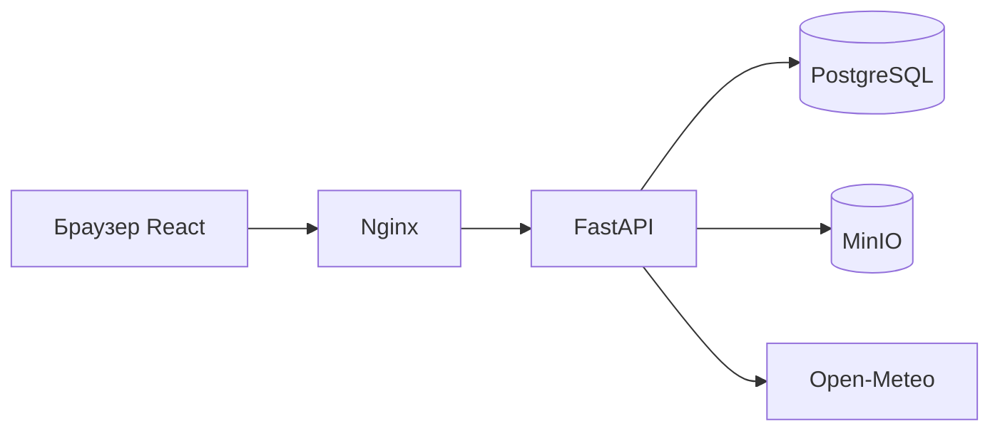
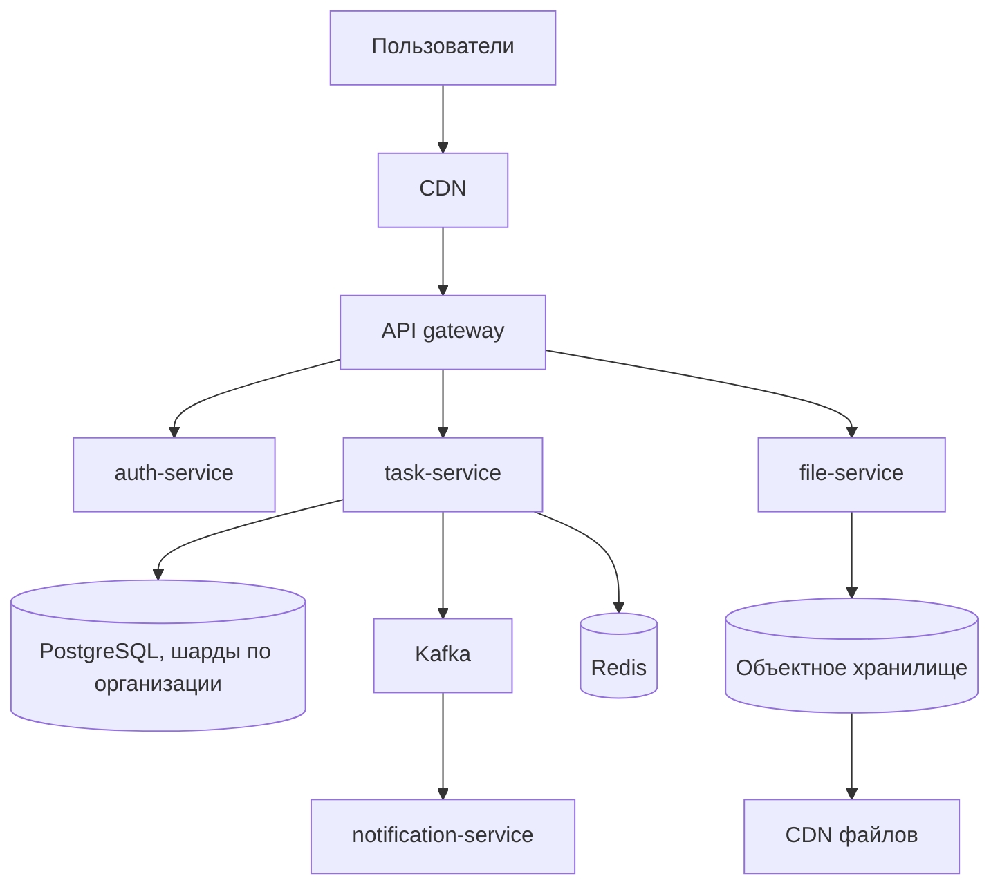

# Отчёт по лабораторным и практическим работам

Курс: Fullstack  
Проект: TaskBoard — доска задач команды  
Стек: Python, FastAPI, TypeScript, React, SQLite / PostgreSQL, Docker

Я делал одну доску задач и наращивал её по лабораторным: роли, токены, фильтры и файлы, SEO и внешний API, тесты, контейнеры. Практические работы тоже про этот проект: часть живёт в приложении, часть — в каталоге `practicals`.

Демонстрационные входы:

- admin@example.com / Admin12345
- manager@example.com / Manager12345
- user@example.com / User12345

## Лабораторная работа 1. Роли и права

### Цель

Спроектировать RBAC для доски задач и применить его на сервере и в интерфейсе. По умолчанию действие запрещено, если его нет в матрице роли.

### Роли

Гость не хранится в базе: это запрос без токена. Остальные роли записаны у пользователя.

| Действие | Гость | Пользователь | Менеджер | Администратор |
| --- | --- | --- | --- | --- |
| Публичные задачи | да | да | да | да |
| Свои задачи | нет | да | да | да |
| Все задачи | нет | нет | да | да |
| Создание | нет | да | да | да |
| Правка своих | нет | да | да | да |
| Правка любых | нет | нет | да | да |
| Удаление своих | нет | нет | да | да |
| Удаление любых | нет | нет | нет | да |
| Модерация чужих | нет | нет | да | да |
| Загрузка файла к своей задаче | нет | да | да | да |
| Удаление своего файла | нет | да | да | да |
| Удаление любого файла | нет | нет | да | да |
| Список пользователей | нет | нет | да | да |
| Смена ролей | нет | нет | нет | да |

Матрица задана в `backend/app/permissions.py`. Тот же набор продублирован в `frontend/src/lib/roles.ts`, чтобы кнопки совпадали с сервером. Сервер всё равно проверяет право сам: скрытая кнопка не заменяет ответ 403.

Дополнительные ограничения:

- пользователь не удаляет задачи, даже свои;
- менеджер удаляет только свои;
- администратор не может сменить роль самому себе и не может снять роль с последнего администратора;
- чужая скрытая задача для гостя и обычного пользователя отвечает 403, а не 200.

### Backend

Проверка стоит в двух местах. Зависимость `require_permission` закрывает маршрут целиком, например создание задачи. Сервисный слой ещё раз смотрит владельца: правка и удаление зависят от того, чья это карточка. Так выполняется и запрет на endpoint, и запрет на конкретную запись.

Смена роли: `PATCH /api/users/{id}/role`. Доступ есть только у администратора. Менеджер может открыть список, но выпадающий список в интерфейсе у него заблокирован.

### Frontend

Меню показывает «Доска» только после входа и «Роли» только при праве `user:read`. Маршруты `/app` и `/admin` обёрнуты в `RequireAuth`. Гость уходит на `/login`, пользователь с чужой ролью — на `/forbidden`. Кнопка «Удалить» у обычного пользователя отрисована неактивной, с пояснением, что роль этого не позволяет.

### Проверка

`backend/tests/test_permissions.py` и `backend/tests/test_tasks.py` проходят матрицу: гость получает 403 на скрытую задачу, пользователь не удаляет, менеджер удаляет свою и не удаляет чужую, администратор удаляет чужую и меняет роль.

## Лабораторная работа 2. Access и refresh токены

### Схема

- Access token — JWT, живёт 15 минут, тип `access`, внутри id пользователя и роль. Им подписываются запросы к API.
- Refresh token — случайная строка. В базе хранится только её SHA-256. Срок жизни 7 дней.
- При обновлении старый refresh помечается отозванным и выдаётся новая пара. Повтор старого refresh отзывает все сессии пользователя: так ловится повторное использование украденного токена.
- Выход отзывает переданный refresh. Дальше им обновиться нельзя.
- Неверный пароль даёт 401 и не сообщает, чего именно не хватило.

### Слои

Запрос идёт так: маршрут (`backend/app/api.py`) → сервис (`AuthService`, `TaskService`, `UserService`, `StorageService`) → репозиторий (`backend/app/repositories.py`). Сервисы приходят в маршруты через `Depends`, это и есть внедрение зависимостей. Пароли хэшируются bcrypt, в ответы пароль не попадает.

Эндпоинты: `POST /api/auth/register`, `/login`, `/refresh`, `/logout`, `GET /api/auth/me`.

### Клиент

Состояние входа лежит в `AuthContext`. Access token держится в `sessionStorage`, refresh — в `localStorage`. Перехватчик axios при 401 один раз вызывает `/api/auth/refresh` и повторяет запрос. Если refresh тоже отклонён, токены стираются и браузер открывает `/login`. Несколько одновременных 401 делят один общий запрос обновления, чтобы не крутить refresh пачкой.

### Проверка

`backend/tests/test_auth.py`: неверный пароль, запрос без токена, мусорный токен, ротация, повтор отозванного refresh, выход. Сквозной сценарий — `backend/tests/test_e2e.py`.

## Лабораторная работа 3. Фильтры, данные и файлы

### Что фильтруется

Сущность — задача. У неё статус, приоритет, публичность, автор и исполнитель. К задаче крепятся файлы.

В каталоге четыре параметра: строка поиска, статус, приоритет и сортировка. Плюс номер страницы. Состояние записано в query string (`frontend/src/lib/filters.ts`), поэтому ссылку с фильтрами можно открыть заново. На сервере те же параметры валидируются: страница от 1, размер до 50, сортировка только из белого списка. Неизвестное поле даёт 422.

Поиск идёт по полю `search_text`, куда название и описание складываются в нижнем регистре. Так кириллица находится и в SQLite, где обычный `lower()` её не меняет.

CRUD: создание, правка, просмотр, удаление. Ошибки разделены: 422 за поля, 401 без входа, 403 без права, 404 если записи нет, 409 если email занят, 410 если публичную задачу сняли в архив.

### Файлы

`StorageService` умеет два хранилища. Без настроек S3 файл пишется в каталог `storage`, а ссылка подписывается HMAC на 5 минут. Если заданы `S3_ENDPOINT`, ключ и секрет, тот же сервис кладёт объект в бакет и отдаёт pre-signed URL. В `docker-compose.yml` для этого поднят MinIO.

Разрешены png, jpg, jpeg, webp, gif, pdf и txt. Размер до 5 МБ. Тип обязан совпасть с расширением. Чужой пользователь не прикрепляет файл к чужой задаче и не удаляет чужой файл. В интерфейсе есть выбор файла, статус отправки, список, картинка с `alt` и `loading="lazy"`, ссылка на скачивание и текст ошибки.

## Лабораторная работа 4. SEO и сторонний API

### Что индексируется

Публичные страницы: главная, каталог, карточка публичной задачи. Служебные закрыты от индекса: вход, регистрация, доска, роли, демо и сравнение API. Это и мета-тег `robots`, и `robots.txt`.

На клиенте компонент `Seo` ставит `title`, description, canonical и Open Graph. Заголовки идут по уровням: на странице один `h1`, дальше `h2` и `h3`. У картинок есть `alt`.

На сервере:

- `GET /robots.txt`
- `GET /sitemap.xml` со ссылками на публичные задачи
- `GET /pages/tasks/{id}` — HTML-страница с настоящим кодом 200, 403, 404 или 410 и блоком JSON-LD типа Article

Человекопонятные адреса: `/`, `/tasks`, `/tasks/12`, `/login`, `/app`.

Тяжёлые разделы (роли, сравнение API, оба демо стейта) загружаются через `React.lazy`. Каталог ходит на сервер одним запросом со всеми фильтрами. Погода запрашивается один раз при открытии доски.

### Сторонний API

Виджет погоды берёт Open-Meteo, ключ не нужен. Вызов спрятан в `WeatherService`: таймаут 5 секунд, одна повторная попытка при таймауте, кэш на 10 минут и ограничение частоты. Ответ приводится к полям `location`, `temperature_c`, `summary`, `available`. Если сервис недоступен и кэша нет, API отвечает 200 с `available: false`, а доска остаётся рабочей. Если кэш уже был, отдаётся он с пометкой `stale`.

## Лабораторная работа 5. Тестирование

### Что считается риском

Вход и отзыв сессии, матрица ролей, фильтры, загрузка файлов, отказ внешнего API.

### Backend

Каталог `backend/tests`:

- модульные проверки матрицы прав и адаптера погоды;
- интеграционные проверки эндпоинтов через `TestClient` и отдельную SQLite в памяти;
- коды ответов, форма страницы, 422 на плохих полях;
- сквозной сценарий в `test_e2e.py`: регистрация, вход, CRUD, фильтр, запрет удаления, файл, refresh, logout, отказ погоды.

Внешняя погода в тестах не вызывается: в адаптер передаётся поддельная функция. Файлы пишутся во временный каталог. Перед каждым тестом схема пересоздаётся.

Запуск: `cd backend && pytest`. Сейчас проходит 21 тест.

### Frontend

Vitest и Testing Library:

- разбор и запись фильтров в адресе;
- валидация пароля и названия;
- матрица кнопок по ролям;
- правило «401 на refresh очищает сессию»;
- форма входа не уходит на сервер с пустым email;
- гость с закрытого маршрута попадает на вход, пользователь — на страницу отказа, администратор проходит.

Запуск: `cd frontend && npm test`. Сейчас проходит 12 тестов. Сборка `npm run build` отдельно проверяет типы.

Имена тестов совпадают с поведением: `test_refresh_rotation_logout_and_reuse`, `защита маршрутов`. Быстрые тесты — модульные, более длинные — `test_e2e.py`. В CI они разведены по двум job: backend и frontend.

## Лабораторная работа 6. Контейнеры и выкладка

### Состав

`docker compose up --build` поднимает:

- `db` — PostgreSQL 16, том `pgdata`, healthcheck `pg_isready`;
- `minio` — объектное хранилище;
- `backend` — образ из `backend/Dockerfile`, ждёт здоровую базу, при старте гоняет `python -m app.migrate`;
- `frontend` — сборка Vite и раздача Nginx;
- `gateway` — Nginx на порту 8080: `/api`, `/graphql`, `/robots.txt`, `/sitemap.xml` и `/pages` идут в backend, остальное во frontend.

Секреты задаются переменными окружения. В репозитории только `.env.example`, без настоящих паролей. `.dockerignore` не копирует в образ базу, тесты и виртуальное окружение.

Если миграция не достучалась до базы или до MinIO, процесс завершается с ошибкой, а `restart: unless-stopped` поднимает его снова. Пока база не здорова, backend не стартует (`depends_on` + healthcheck).

CI в `.github/workflows/ci.yml` на каждый push ставит зависимости, гоняет pytest, тесты фронтенда и сборку. Образ в реестр я не публиковал: перед сборкой прогоняются тесты, а локально проект поднимается через `docker compose up`.

## Практическая работа 1. Context и Redux

Я сделал две одинаковые мини-доски. У каждой три файла, как просит задание.

Context API:

- `frontend/src/practical1/context/model.ts` — тип задачи и начальные данные;
- `TodoContext.tsx` — `createContext`, провайдер, `useContext`;
- `ContextApp.tsx` — форма и список.

Redux Toolkit:

- `frontend/src/practical1/redux/model.ts`;
- `todoSlice.ts` — `createSlice`, редьюсеры, экшены;
- `ReduxApp.tsx` — store, `Provider`, `useSelector`, `useDispatch`.

Маршруты: `/demo/context` и `/demo/redux`.

В основном приложении вход сознательно оставлен на Context. Это одно небольшое состояние «кто вошёл», его читают меню и маршруты. Redux здесь дал бы store, слайс и провайдер ради пары полей.

| Критерий | Context | Redux Toolkit |
| --- | --- | --- |
| Объём кода | меньше | больше за счёт slice и store |
| Масштаб | удобно для темы, языка, сессии | удобно, когда много связанных экранов |
| Отладка | обычный React DevTools | отдельная история действий |
| Гибкость | состояние можно размазать по нескольким контекстам | одно хранилище и явные события |

Context хватает, пока обновление редкое и потребителей немного. Redux уместен, когда нужно воспроизвести цепочку действий и когда одни и те же данные правят много независимых модулей. Для этой доски сессия остаётся в Context, а практическая показывает оба варианта на одном и том же списке.

## Практическая работа 2. Event loop

Скрипт `practicals/02-event-loop/demo.mjs` прогнан в Node. Порядок первого примера совпал с методичкой:

```
gegegeg
Step 2: In promise constructor
tetete
Step 3: In then
Step 1: In setTimeout
Step 5: In another setTimeout
Step 4: In setTimeout (inside of "then")
```

Синхронный код выполняется сразу, поэтому сначала видны `gegegeg`, конструктор промиса и `tetete`. Колбэк `then` — микрозадача. Таймеры — макрозадачи. После синхронного кода движок вычищает очередь микрозадач и только потом берёт таймеры. Поэтому `Step 3` раньше любого `setTimeout`. `Step 4` ставится в очередь таймеров уже из микрозадачи, поэтому он последний.

Второй пример в том же файле ставит цепочку промисов и таймер, а внутри таймера — ещё две микрозадачи. Фактический вывод:

```
Start
End
P1: первый then
P2: второй then
Step 4
A: таймер
C: синхронный код того же таймера
B: микрозадача
B2: ещё одна микрозадача
```

`Start` и `End` синхронные. `P1` и `P2` — микрозадачи, они идут до следующего таймера. Внутри таймера `A` и `C` печатаются синхронно, а `B` и `B2` ждут, пока этот таймер закончится: микрозадачи, созданные внутри макрозадачи, выполняются сразу после неё и раньше следующего таймера.

Колбэки `setTimeout` относятся к очереди макрозадач. Колбэки промиса и `queueMicrotask` — к микрозадачам. Микрозадача раньше таймера, потому что event loop после каждой макрозадачи опустошает всю очередь микрозадач.

## Практическая работа 3. SQL и NoSQL

Домен — каталог книг. Сущности SQL: автор, книга, выдача. Книга ссылается на автора, выдача — на книгу.

Схема и запросы: `practicals/03-sql-nosql/schema.sql`, `queries.sql`. Запуск без установки PostgreSQL: `python practicals/03-sql-nosql/run_demo.py`. Та же схема выполняется в PostgreSQL. В Docker само приложение TaskBoard как раз сидит на PostgreSQL.

Скрипт печатает:

- выборку книг с автором и фильтром по году;
- агрегацию «сколько книг у автора»;
- транзакцию выдачи, которая откатывается, после неё число выдач остаётся 0.

Документный вариант в том же скрипте хранит книгу одним JSON-документом: автор вложен, теги — массив. Третьей книге добавляется поле `isbn` без изменения схемы. Тот же сценарий для настоящего MongoDB — `mongo_demo.py` (нужен `mongodb://localhost:27017`).

| Критерий | SQL | Документы |
| --- | --- | --- |
| Проектирование | дольше: таблицы, ключи, нормальная форма | быстрее: документ близок к ответу API |
| Изменение структуры | миграция | новое поле можно добавить одной записи |
| Запросы | JOIN и GROUP BY выразительны | проще выборка по полям документа, сложнее произвольные связи |
| Нагрузка | вертикальный рост и аккуратные индексы | проще горизонтально, ценой строгой согласованности |

Для TaskBoard выбран SQL. У задачи есть владелец, исполнитель и роли, это связи и ограничения, а не лента свободных документов. Документы были бы уместнее для ленты событий или черновиков без жёсткой схемы.

## Практическая работа 4. REST и GraphQL

Обе схемы смотрят в одну базу.

REST, Swagger на `/docs`:

- `GET/POST /api/users`, `PATCH /api/users/{id}/role`
- `GET/POST /api/tasks`, `GET/PATCH/DELETE /api/tasks/{id}`
- файлы и вход описаны рядом

GraphQL на `/graphql`, библиотека Strawberry. Тип `GUser` содержит список `tasks`, поэтому клиент забирает человека и его задачи одним запросом. Мутация `createTask` без access token возвращает ошибку.

Страница `/compare` делает два замера:

- REST: `GET /api/tasks`, затем `GET /api/tasks/{id}` — два обращения, в ответ попадает вся карточка со служебными полями;
- GraphQL: один запрос `task` и `tasks` с выбранными полями.

Запросов меньше у GraphQL, объём тоже обычно меньше, потому что клиент не обязан забирать `owner_id` и даты, если они не нужны. Обратная сторона: кэш по URL у REST бесплатный, а у GraphQL один адрес `/graphql` на все операции, плюс сложнее резать права по полям.

Для TaskBoard основным интерфейсом оставлен REST. Операции простые, их удобно кэшировать и описывать в Swagger. GraphQL подключён как второй вход для экранов, которым нужна карточка вместе со списком. Версионирование REST здесь не потребовалось: новые необязательные поля добавляются в JSON, старые клиенты их игнорируют.

## Практическая работа 5. Системный дизайн

Выбран вариант 30 — система управления проектами, аналог небольшой доски.

### Требования

Функциональные: регистрация, роли, задачи, фильтры, вложения, публичный каталог.

Нефункциональные для учебной нагрузки: до 5 тысяч пользователей, до 50 одновременных запросов, ответ списка задач до 300 мс на тёплом кэше, хранение вложений до 5 МБ, доступность учебного стенда 99% в рабочее время. Это не интернет-масштаб, поэтому микросервисы не нужны.

### High-level design



Канал браузера и API — HTTPS и JSON. Вход — access JWT и refresh. Роли проверяются в сервисе. Отдельной очереди на этом размере нет: загрузка файла синхронная и короткая. Кэш — в памяти процесса для погоды. Если стенд упрётся в чтение каталога, первый шаг — индекс по `status`, `priority`, `is_public` и кэш публичной первой страницы, а не распил на сервисы.

Узкое место — отдача файлов и поиск. Файлы уходят в объектное хранилище, API их не стримит через себя при включённом S3. Поиск ограничен полями названия и описания, без полнотекстового движка, этого хватает на объём учебной базы.

## Практическая работа 6. Системный дизайн, крупный масштаб

Тот же продукт, растянутый до варианта «платформа совместной работы» на миллионы пользователей: доски, комментарии, вложения, присутствие в карточке.

Целевая аудитория — команды в разных регионах. Данные — десятки терабайт вложений и сотни гигабайт метаданных. Отклик списка доски — до 200 мс в регионе пользователя. Нельзя останавливать чтение досок и загрузку файлов. Создание задачи может пережить короткую задержку.

### Архитектура



Подход — микросервисы по доменам и события после записи. Базы метаданных стоят в нескольких зонах региона, кэш ближе к пользователю, файлы за CDN. Шардирование задач — по id организации, чтобы доска одной команды лежала на одном шарде. Репликация PostgreSQL — синхронная в зоне и асинхронная в соседний регион.

### Отказы и CAP

Падение одного экземпляра API закрывает балансировщик. Оркестратор поднимает новый под. Миграции идут отдельно от трафика и не блокируют чтение. Мониторинг: доля 5xx, задержка, отставание реплики, глубина очереди.

Для ленты активности выбран компромисс AP в смысле CAP: при разрыве сети между регионами пользователь читает свою реплику, запись догоняет позже. Это eventual consistency. Сама смена роли и удаление задачи остаются на основном регионе и требуют кворума записи: здесь важнее не показать чужие права, чем ответить мгновенно из любого дата-центра.

## Практическая работа 7. Стек клиентского приложения

Вариант 13 — канбан-доска для командной работы. Аудитория — учебная группа и небольшая команда. Функции: каталог, своя доска, карточка, вложения, роли.

Стек:

- React и TypeScript — компоненты и проверка типов до запуска;
- состояние сессии — Context, потому что оно одно и читается повсеместно;
- списки на демо — Redux Toolkit, чтобы сравнить подход;
- маршруты — React Router;
- стили — один CSS-файл без UI-китa, доска небольшая и не требует рантайма CSS-in-JS;
- запросы — axios с одним перехватчиком.

Архитектура классическая с намёком на слои: `pages`, `components`, `auth`, `api`, `lib`. Этого хватает на размер проекта. Feature-Sliced был бы оправдан, если бы доску пилили несколько человек и фичи начали делить общие компоненты. Микрофронтенды здесь лишние: команда одна, релиз один.

Дополнительные библиотеки:

- React Router — адреса каталога и закрытые маршруты;
- axios — перехват 401 в одном месте;
- react-helmet-async — title и canonical без своего SSR;
- Redux Toolkit — только практическая мини-доска.

Таблицы, графики, карты и перетаскивание я не подключал: канбан показан списком карточек с фильтрами. Если позже появятся колонки, взял бы dnd-kit: она легче старого react-beautiful-dnd и нормально работает с клавиатурой.

Схема экрана: шапка читает сессию, каталог читает только URL и ответ API, форма пишет через axios. Глобального хранилища задач нет, источник правды — сервер. Так проще не разъехаться с правами.

## Практическая работа 8. Крупный клиент

Вариант 19 — портал задач для больших команд. Масштаб: десятки команд, несколько регионов, доска не должна падать целиком из-за одного модуля. Нужны разделение прав, постепенная выкладка и общий визуальный язык.

Стек по модулям:

- оболочка на React и TypeScript, сборка Vite;
- для независимого релиза модулей — Webpack Module Federation: каталог, карточка, админка и отчёты собираются отдельно;
- серверное состояние — TanStack Query, чтобы кэш, повтор и состояние загрузки не писать руками;
- локальный интерфейсный стейт — Zustand или Context внутри модуля;
- роутер оболочки владеет адресами, модуль регистрирует свои маршруты;
- стили — общий пакет токенов и CSS-модули, чтобы команды не перекрашивали чужие экраны.

Архитектура — вертикальные микрофронтенды по доменам: доски, админка ролей, отчёты. Внутри модуля слои ближе к FSD: `pages`, `features`, `entities`, `shared`. Общая библиотека UI и клиент авторизации публикуются пакетом. Модули не импортируют друг друга напрямую, только через эту библиотеку или через событие оболочки (пользователь вышел, организация сменилась).

Команды договариваются о макете в общем пакете. Оболочка рисует шапку и решает, какой модуль смонтировать. Данные между модулями не шарятся через общий Redux: каждая команда запрашивает свой API и кэширует его у себя. Иначе релиз одной команды ломает хранилище другой.

Библиотеки по модулям:

- TanStack Query — списки и карточки;
- React Hook Form и Zod — формы задачи и приглашения, схема одна на клиенте и близкая к Pydantic на сервере;
- dnd-kit — колонки доски;
- Chart.js — модуль отчётов, не попадает в бандл доски.

Trade-off: независимость команд покупается ценой более сложной оболочки, дублирования зависимостей и риска разного вида кнопок, если общий пакет забросить. На среднем проекте из практической 7 это не окупается. На портале из многих команд окупается.

## Вывод

Я собрал TaskBoard как одно приложение и проверил его по ролям. Гость видит только публичный каталог. Пользователь создаёт свои задачи и не может их удалить. Менеджер правит чужие карточки, но удаляет только свои. Администратор меняет роли и удаляет любые задачи. Фильтры, файлы, обновление токена, sitemap и виджет погоды работают вместе с этой моделью доступа. Тесты backend и frontend это фиксируют.
